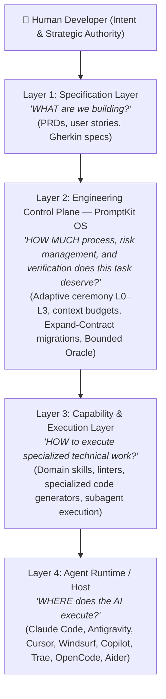

# Host & Tool Comparisons

How PromptKit OS relates to AI assistant hosts, external skill systems, and alternative approaches. Relocated from the README so the front door stays short; no claim changed.

---

## Host & External Tool Composition

PromptKit OS coexists cleanly with host-specific instruction files (`AGENTS.md`, `CLAUDE.md`, `GEMINI.md`, `.cursorrules`, `.cursor/rules/promptkit.mdc`, `.windsurfrules`, `.clinerules`, `.traerules`, `.opencode/rules.md`, `.github/copilot-instructions.md`), external skill libraries (such as `skills.sh`), host `/skill` commands, and complementary specification systems (Spec Kit, BMad).

### Authority & Governance Boundary

- **Specialized Assistance**: External skills and host tools provide domain-specific knowledge, code generation assistance, or specialized refactoring helpers.
- **PromptKit Authority**: PromptKit OS remains authoritative for **Level 0–3 task classification**, lifecycle routing, required verification evidence, Task Record requirements, release boundaries, and human authorization.
- **Non-Bypass Rule**: External skills must act as subordinate helpers. They must **never** silently commit, push, merge, tag, publish, deploy, or bypass required verification gates.
- **Behavioral Variation**: Host agents enforce instructions with varying degrees of fidelity. PromptKit OS provides protocol standards, but host enforcement depends on the AI agent host.

### Host Compatibility Matrix

| Environment / Tool | Configuration Integration | Repo / CI Validation | Actual Host Behavior Verification |
| :--- | :---: | :---: | :---: |
| **Claude Code** | ✅ `CLAUDE.md` | ✅ CI Syntax & Reference Checks | ⚠️ Dependent on Claude Code runtime |
| **Antigravity / Gemini CLI** | ✅ `AGENTS.md` / `GEMINI.md` | ✅ CI Behavioral Contract Tests | ⚠️ Dependent on Gemini runtime |
| **Cursor IDE** | ✅ `.cursorrules` / `.cursor/rules/promptkit.mdc` | ✅ CI Syntax & Reference Checks | ⚠️ Dependent on Cursor Agent runtime |
| **Windsurf IDE** | ✅ `.windsurfrules` | ✅ CI Syntax & Reference Checks | ⚠️ Dependent on Cascade runtime |
| **Cline / Roo Code** | ✅ `.clinerules` | ✅ CI Syntax & Reference Checks | ⚠️ Dependent on Cline/Roo runtime |
| **Trae IDE** | ✅ `.traerules` | ✅ CI Syntax & Reference Checks | ⚠️ Dependent on Trae Agent runtime |
| **OpenCode** | ✅ `.opencode/rules.md` | ✅ CI Syntax & Reference Checks | ⚠️ Dependent on OpenCode runtime |
| **GitHub Copilot** | ✅ `.github/copilot-instructions.md` | ✅ CI Syntax & Reference Checks | ⚠️ Dependent on Copilot runtime |
| **Aider** | ✅ `CONVENTIONS.md` | ✅ CI Syntax & Reference Checks | ⚠️ Dependent on Aider runtime |
| **External Skills (skills.sh / `/skill`)** | ✅ Subordinate helper rules | ✅ Reference Checks | ⚠️ Execution varies by skill implementation |

---

## The 4-Layer AI Engineering Stack

To understand where PromptKit OS fits alongside other developer tools, prompts, and plugins, it helps to view the AI-assisted development ecosystem across four distinct layers:

### Layer Breakdown

1. **Layer 1: Specification Layer (`WHAT`)**: Defines requirements, business constraints, user journeys, and acceptance criteria before implementation starts.
2. **Layer 2: Engineering Control Plane & JIT Knowledge — PromptKit OS (`HOW MUCH PROCESS, RISK & INVARIANTS`)**: Operates as the neutral governor of the software development lifecycle. It determines whether a task is trivial (Level 0/1) or high-risk (Level 2/3), injects required workflows, JIT Stack Playbooks (`docs/stacks/`), and Contract Boundary Recipes (`docs/recipes/`) on demand, tracks cross-session state (`STATE.md`), enforces non-breaking database safety, and validates done-gates.
3. **Layer 3: Capability & Execution Layer (`HOW TO EXECUTE`)**: Contains specialized assistance: language-specific tools, domain prompt libraries, refactoring helpers, or local scripts.
4. **Layer 4: Agent Runtime / Host (`WHERE`)**: The underlying LLM interface and tool-use environment (Claude Code, Gemini CLI, Cursor, Windsurf, Copilot, etc.).

---

## Multi-Tool Composition & Avoiding Control Loop Collisions

A common failure mode in AI-assisted workflows occurs when developers install multiple prompt frameworks, orchestration systems, or autonomous loops simultaneously.

### The Single Control Owner Principle

If two independent systems both attempt to govern the task lifecycle (planning ➔ task decomposition ➔ execution ➔ verification ➔ done-gates), they enter a **Control Loop Collision**:
- Conflicting instructions confuse the host model into recursive meta-planning loops.
- Token consumption balloons as multiple monolithic instruction sets are dumped into context.
- Done-gate ambiguity causes premature commits or infinite repair loops.

**Rule**: *Only one system should own the engineering control plane and verification done-gates for a repository.*

### How to Layer Helpers Safely

PromptKit OS is designed to act as the authoritative **Layer 2 Control Plane** while allowing external prompt packs and skill collections to plug in as **Layer 3 Subordinate Helpers**:

1. **PromptKit Remains Authoritative**: Level 0–3 risk classification, milestone boundaries, Git commit gating (`pk:commit`), and machine-verified exit code 0 (`Bounded Oracle`) are governed by PromptKit.
2. **Subordinate Execution**: External tools provide specialized domain help (e.g., writing a complex CSS animation, drafting a regex, or running a specific linter) without attempting to bypass PromptKit's git boundary or lifecycle state.
3. **JIT Loading Prevents Bloat**: Rather than loading hundreds of external skills statically, reference specialized capabilities on-demand so static context remains sub-1,500 tokens (Lite) or sub-2,500 tokens (Balanced).

### PromptKit's Defining Question: Adaptive Ceremony

While rigid methodologies force heavy specification and testing loops on every localized tweak, PromptKit's core philosophy is:

> **"How much engineering process does this specific task actually deserve?"**

- **Level 0**: Single-line typo, string update, documentation touch. Zero ceremony, no Task Records.
- **Level 1 (Standard)**: Localized component tweak, bug fix, isolated utility. Socratic focus, minimum workflow, no Task Record.
- **Level 2 (Controlled)**: Multi-file feature, internal contract change, new route. Mandatory Task Record, architecture check, Bounded Oracle verification.
- **Level 3 (Release-Critical)**: Public API contract, database schema migration, authentication/authorization, production release. Strict Expand-Contract phased migrations, human sign-off, full verification evidence.

---

## How PromptKit Differs from Other Tools

| Dimension | Single-File Directives | Static Prompt Packs | Autonomous Multi-Agent Swarms | **PromptKit OS** |
| :--- | :--- | :--- | :--- | :--- |
| **Scope** | Tool-specific instruction endpoint | Workflow templates for one tool | Multi-agent unmonitored loops | Cross-tool engineering OS with 24 lifecycle workflows |
| **Token Overhead** | Minimal initial overhead | High monolithic bloat | Higher aggregate token cost from multi-agent pipeline calls | **Measured baseline profile overhead\*** (See `BENCHMARKS.md` for current measurements; unused workflows consume 0 tokens) |
| **Persistence** | Per-session only | Per-session only | Hidden cache directories prone to context exhaustion | Git-tracked `docs/STATE.md` survives context resets & fresh chats |
| **Execution Model** | Unstructured chat | Manual template pasting | Background loop until timeout or crash | Disciplined human-in-the-loop pairing (Levels 0–3) |
| **Database Safety** | No schema guardrails | Varies | Risk of destructive drops in unmonitored edits | Expand-Contract only (phased, non-breaking migrations) & strict Project-Scoped DB container isolation |
| **Multi-Agent** | Single agent | Single agent | Unmonitored recursive agent spawns | Subagent delegation with compact synthesis (~98% parent context payload reduction) |
| **Done-Gates** | Trust the model | Trust the model | Fragile timeout heuristics | Artifact gates + Gherkin verification + CI + human review |
| **Lock-in** | Tool-specific format | Tool-specific format | Framework-specific runtime & daemons | Pure markdown, works with any AI coding assistant |

*\* Measured mechanically via `scripts/measure-tokens.sh` / `measure-tokens.ps1` (bytes/4 convention). See [`BENCHMARKS.md`](./BENCHMARKS.md) for current full context window analysis.*

---

## Related References

- [`../README.md`](../README.md) — Front door: pitch, install, Level model, worked example
- [`BENCHMARKS.md`](./BENCHMARKS.md) — Token economics behind the comparison figures
- [`BENCHMARK-METHODOLOGY.md`](./BENCHMARK-METHODOLOGY.md) — Cost Per Accepted Change (CPAC) empirical framework
- [`../FAQ.md`](../FAQ.md) — The 20 questions every developer asks before adopting
