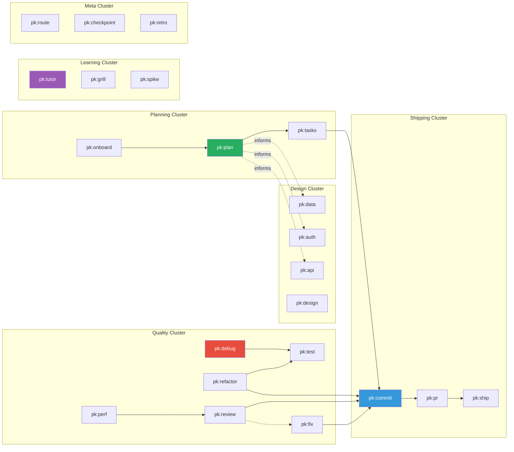

# PromptKit OS Workflow Decision Map

Visual guide to help you quickly find the right workflow for your current task.

## Lite Map (Onboarding — 5 Nodes)

New users start here. Full 24-workflow map ships below; unneeded workflows cost 0 tokens (JIT).

```text
pk:route → pk:plan / pk:tasks → pk:debug → pk:commit → pk:checkpoint
 (GPS)      (spec / breakdown)   (fix)       (save)      (handover)
```

- Tracker lives at `PROMPTKIT.md` `tracking: local|github|jira|linear` (Jira/Linear = manual import, no auto-push).
- Output: TL;DR top → Details → Next; choices priced; single 3-line card with `[■■■■□□]` bar.

---

## Work Classification First (Task Ceremony Levels)

Before selecting a workflow, classify the request using the composable 4-level ceremony model:

- **Level 0 — Direct (Trivial Work)**: Questions, explanations, doc typos, syntax lookups, formatting, or tiny single-line tweaks. `understand → change → verify` with zero workflow ceremony or task record creation.
- **Level 1 — Standard (Lightweight Work)**: Localized bug fixes, small self-contained feature tweaks, or single-component enhancements modifying source files without schema/auth/breaking contract risks. Uses natural workflow routing (`pk:debug`, `pk:test`) with lightweight inline planning; does NOT require a formal Task Record file (`docs/tasks/<task-id>.md`).
- **Level 2 — Controlled (Controlled Work)**: Relational schema/data migrations, auth, permissions, breaking API contracts, or multi-component architectural changes. Requires a canonical Local Task Source at `docs/tasks/<task-id>.md` and RFC specification (`pk:plan`, `pk:data`, `pk:auth`) before implementation.
- **Level 3 — Release-Critical (Release Work)**: Production releases, deployments, tag creation, or high-impact contract changes. Uses Level 2 evidence plus full candidate evaluation (`pk:ship`), QA review, contract evidence, and explicit human authorization. A Level 3 downgrade requires a documented reason, confirmation that no release actions remain in scope, Release Coordinator approval, and evidence preservation.

For authoritative Level 0–3 classification, escalation, downgrade, and Task Record rules, see [`workflows/route.md`](../workflows/route.md). For context acquisition rules, the Z0–Z4 zoom ladder, and the Context Provider Capability Contract, see [`protocols/context-economy.md`](../protocols/context-economy.md).

- The Task Record is authoritative for Controlled Work. `docs/STATE.md` is a synchronized projection owned by `pk:checkpoint`; external issues, dated breakdowns, board statuses, and conversation claims are supporting references.
- Existing records, workflow triggers, owners, approval boundaries, release protections, and rollback boundaries remain valid. Adaptation fields and sections are additive and do not require retroactive migration.

## Adaptation Authority Matrix

The Adaptation adds evidence and planning guidance without creating a competing lifecycle or execution authority:

| Evidence or decision | Primary owner | Boundary |
| :--- | :--- | :--- |
| Work classification and lifecycle navigation | `pk:route` | Solely classifies requests into the canonical 4-level task ceremony model (Level 0 Direct, Level 1 Standard, Level 2 Controlled, Level 3 Release-Critical) and routes to existing workflows; planning depth cannot override it. |
| Planning depth, planning inputs, assumptions, and material decision provenance | `pk:plan` | Supplies architecture and planning evidence; does not set execution state or approve implementation/release. |
| Task decomposition, acceptance criteria, and stable task identity | `pk:tasks` | Creates task inputs and links; does not replace the Local Task Record’s readiness or completion authority. |
| Controlled readiness, execution state, active ownership, and completion | Canonical Local Task Record | Sole execution authority for Controlled Work; external trackers and projections cannot override it. |
| Checkpoints, handoffs, and state projection | `pk:checkpoint` | Preserves and projects evidence; does not approve, commit, release, deploy, or roll back. |
| Test strategy and test intent | `pk:test` | Defines seams, test intent, and verification approach; does not control execution state. |
| TDD execution evidence | Canonical Local Task Record | Owns Red/Green/Refactor execution evidence when the Task Record's TDD Enforcement Mode is enabled for Code Work; test-plan records remain supporting references. |
| In-scope implementation | Engineer through the selected workflow | Changes only the approved scope and records evidence in the Local Task Record. |
| Review findings and simplification recommendations | `pk:review` | Reports findings and recommendations in the canonical `docs/reviews/<review-slug>.md` report; does not edit source or approve release/external actions. |
| Commit evidence | `pk:commit` | Prepares atomic, reviewable commit evidence; human confirmation remains required for repository changes. |
| Pull request evidence | `pk:pr` | Prepares the PR description and verification evidence; does not merge or approve on behalf of a human. |
| CI failure evidence and remediation linkage | CI triage owner, when the later overlay is implemented | Records evidence and bounded plans; does not retry, mutate remote configuration, deploy, or approve. |
| Release readiness and evaluation | `pk:ship` | Evaluates release readiness and preserves the existing release record and rollback boundaries. |
| External-action approval | Human Release Coordinator | Separately decides tag, publication, remote operation, deployment, and rollback; no workflow or validator authorizes these automatically. |

This matrix is the shared authority reference for `pk:route`, `pk:plan`, and later Adaptation overlays. It records ownership without requiring the later artifact schemas or validator profile. This follow-up is additive to the immutable published `v1.0.0` baseline and is not an approved `v1.1.0` release.

<a id="canonical-artifact-contract"></a>
## Canonical Artifact Contract

This section is the single Phase 3 contract for artifact locations, identities, fields, lifecycle states, links, ownership, and validator boundaries. Workflows and templates may explain the contract, but they must not create a competing schema or authority.

### Identity and Link Rules

- All Adaptation artifact IDs are immutable. Slugs use lowercase kebab-case. `<nnn>` is a zero-padded three-digit sequence. `behavior-seq` is the corresponding zero-padded Behavior ID sequence.
- The canonical identity formats are: `PLAN-<spec-slug>`, `ASSUMPTION-<spec-slug>-<nnn>`, `DECISION-<spec-slug>-<nnn>`, `CLAIM-<decision-id>-<nnn>`, `CITATION-<decision-id>-<nnn>`, `UNCERTAINTY-<decision-id>-<nnn>`, `TASK-<task-slug>`, `BEHAVIOR-<task-slug>-<nnn>`, `TDD-INTENT-<task-slug>-<nnn>`, `TDD-EXEC-<task-slug>-<behavior-seq>`, `REVIEW-<review-slug>`, `SIMPLIFICATION-<review-id>-<nnn>`, `CI-<provider>-<run-id>`, `ACTION-<ci-id>-<nnn>`, and `RELEASE-<release-slug>`.
- Cross-record links use `[<stable-id>](<relative-path>#<stable-id>)`. A same-file link uses `[<stable-id>](#<stable-id>)`. Every target exposes its exact immutable ID as an explicit HTML anchor immediately before the record heading, for example `<a id="PLAN-checkout"></a>` for `PLAN-checkout`.
- `Required`, `Optional`, and `Not applicable` are field statuses, not suggestions. `N/A — <reason>` is valid only where the matrix permits it. `None` means the field has no entries and is not the same as an omitted Required field.

### Technology Version-Selection Policy

This is the shared policy for material Technology or Vendor Decisions that include a version:

- For greenfield work with no existing pin, user preference, or explicit constraint, recommend the latest supported stable version compatible with project runtime, platform, dependency, API, deployment, and support constraints. "Latest" means latest supported stable compatible release, not blindly the newest available release.
- Stable means production-stable; prefer actively supported or LTS where applicable. Never default to prerelease, nightly, experimental, or otherwise unsupported channels.
- For existing projects, preserve current pinned versions by default. Do not silently upgrade. An upgrade requires an explicit request or recorded security, support/lifecycle, compatibility, or other material evidence, with migration and rollback impact recorded when relevant.
- An older version requires an explicit rationale, named decision owner, and support/lifecycle and compatibility evidence. Incomplete, stale, inaccessible, or conflicting evidence remains uncertainty.
- The Planning Record must capture exact selected version or versions, release channel, support/lifecycle status, compatibility constraints, rationale, citations, citation access date, and exact-version evidence. `latest` or an unbounded range is not an exact selection.
- AI or PromptKit may recommend and summarize evidence, but the named decision owner must approve the recommendation, approve a deviation, or accept the documented assumption. User preference or project constraints may override the default when recorded.
- Unclear or conflicting evidence requires defer, a targeted `pk:spike`, or an explicitly accepted assumption owned by the decision maker. No workflow may guess or silently finalize the version.

### Canonical Artifact Matrix

| Artifact | Canonical location and authority | Required fields | Optional fields | Not applicable fields | Allowed states |
| :--- | :--- | :--- | :--- | :--- | :--- |
| Planning Record | Section in `docs/specs/<specification>.md`, owned by `pk:plan` | ID, Planning Depth, Requested Outcome, Observable Completion Condition, Scope Boundary, Owner, Record Status; Full mode also requires Explicit Non-Goals, Affected Behavioral Components, Externally Visible Contracts, Failure or Rollback Considerations, and Verification Approach | Local Task Record link and workflow links | Full-only fields in Minimal mode with an explicit `N/A — Minimal depth` reason | `draft`, `ready`, `blocked`, `superseded` |
| Assumption Record | Section in the Planning Record, owned by `pk:plan` | ID, Unanswered Decision, Provisional Answer, Impact if Wrong, Validation Action, Decision Owner, Status | Supporting Evidence and Resolved-Decision Link | Resolution Evidence while unresolved, recorded as `N/A — unresolved` | `open`, `validated`, `accepted`, `rejected`, `superseded` |
| Decision, Claim, Citation, and Uncertainty records | Sections in the Planning Record, owned by `pk:plan` | Decision: Decision ID, Statement, Options, Selected or Rejected Options, Claims, Owner, Status. Claim: Claim ID and link to a Citation or Uncertainty. Citation: Citation ID, Publisher, Title, Canonical URL, Access Date, Supported Claim. Uncertainty: Uncertainty ID, Impact, Resolution Action, Owner, Status | `pk:spike` link and additional source notes | Uncertainty when a decision has no unresolved claim, recorded as `None` | Decision: `proposed`, `decided`, `deferred`, `superseded`; Citation: `candidate`, `verified`, `stale`, `inaccessible`, `conflicting`, `superseded`; Uncertainty: `open`, `resolved`, `accepted`, `deferred`, `superseded` |
| Local Task Record | `docs/tasks/<task-id>.md`, owned by the Local Task Record for execution | Task ID, Specification, Work Type, Objective, In Scope, Explicit Non-Goals, Acceptance Criteria, Verification Condition, Execution Policy, TDD Enforcement Mode, Execution State, active ownership, and completion evidence applicable to the state | Planning, Assumption, Test, Review, CI, Commit, Pull Request, Checkpoint, Handoff, and Release links | TDD intent and execution evidence when disabled, or an exception verification link and reason for Documentation, Configuration, or Research Work | Existing execution states: `planned`, `ready`, `in_progress`, `checkpoint_due`, `blocked`, `paused`, `handoff_ready`, `awaiting_review`, `completed`, `aborted` |
| TDD intent register | Existing `docs/tests/<test-plan>.md`, owned by `pk:test` for intent only | Intent ID, Task Record Link, Behavior ID, Mode Reference, Test, Expected Failing Assertion, Runnable Command, Status | Seam and framework notes | Complete intent register when disabled, recorded as `N/A — TDD Enforcement Mode disabled` | `proposed`, `ready`, `superseded` |
| TDD execution evidence | `docs/tasks/<task-id>.md`, owned by the Local Task Record | Execution ID, Behavior ID, Task Record Link, Red Result, Green Result, Refactor Result, Commands and Results, Status | Test-plan link and notes | Red, Green, and Refactor fields for Documentation, Configuration, or Research Work only when an exception verification link and reason are recorded | `planned`, `red_recorded`, `green_recorded`, `refactor_recorded`, `exception`, `blocked`, `complete` |
| Simplification Audit | Existing `pk:review` report at `docs/reviews/<review-slug>.md`, owned by `pk:review` | Review ID, resolved non-empty diff reference, candidate ID or explicit `No Simplification Candidates found`; candidates require Location, Diff Evidence, Preservation Condition, Risk, Verification, and Recommendation | Baseline and related review links | Candidate fields when the explicit no-candidate result is recorded | `draft`, `complete`, `superseded` |
| CI Triage Record | `docs/releases/ci-triage/<ci-failure-id>.md`, owned by the CI triage owner in the later overlay | CI ID, Evidence, Owner, State, Classification when sufficient, Remediation Plan when supported, Verification Evidence, Resume Condition, and `pk:ship` link for release candidates; one action block per proposed remote action | Authenticated read-only retrieval metadata and `pk:debug` link | Classification and remediation before evidence is sufficient; action-confirmation block when no remote action is proposed | `evidence_requested`, `evidence_sufficient`, `classified`, `remediation_planned`, `awaiting_confirmation`, `local_reproduction_or_fix`, `verification_pending`, `verified`, `linked_to_pk_ship`, `blocked` |
| CI action block | Within the owning CI Triage Record, one block for each action | Action ID, Proposed Action, Confirmation State, Approver, Confirmation Timestamp, Bounded Scope, Reversal or Rollback Action, Resume Condition | Read-only evidence reference | Approver and timestamp are `N/A — awaiting confirmation` only while confirmation is `pending`; the action collection is `N/A — no remote action proposed` when no action is planned | Confirmation state: `pending`, `confirmed`, `declined` |
| Release linkage | Existing `docs/releases/<release>.md`, owned by `pk:ship` | Release ID, CI Triage Link, Verification Link, Verified Result, Resume Condition | Review and Task Record links | CI Triage Link when the release has no CI failure | Existing `pk:ship` release states; linkage recognizes only `pending`, `blocked`, `verified`, and `linked_to_pk_ship` evidence states |

### Cross-Record Invariants

- Each stable ID is unique, immutable, and exposed by the target record's explicit anchor. No record is both embedded and standalone unless this matrix explicitly says so.
- Every link uses the declared relative-path and anchor syntax and resolves to the target's same stable ID. Broken links, duplicate IDs, and conflicting authorities are invalid.
- The Local Task Record owns TDD Enforcement Mode and TDD execution state. TDD intent is owned by `pk:test` for planning only. TDD intent and execution must use the same Behavior ID.
- Material claims link to a Citation or Uncertainty. A planning proposal or test-plan value never overrides the Task Record.
- Each proposed remote action has exactly one independent confirmation block. Confirming or declining one action never authorizes or decides another, and recording confirmation never executes the action.
- Release resumption requires CI state `verified` followed by `linked_to_pk_ship`; classification, a passing unrelated check, or a proposed remediation is insufficient.

### Validator Boundary and Deferred Scope

The future Adaptation validator boundary is deterministic and network-free. It may validate paths, IDs, field labels, explicit anchors, links, allowed states, required-field conditions, ownership, invariants, and deferred-scope rules. It must not verify external URLs, execute commands, retrieve remote evidence, or authorize remote, release, deployment, publication, tag, or rollback actions.

Phase 3 does not change `scripts/validate-execution-control.ps1` or `scripts/validate-execution-control.sh`. Those validators continue to validate legacy Task, Scope Change, Checkpoint, and Handoff records with their existing labels and date-based ID rules. The later Task 13 boundary may use `PromptKit Adaptation Profile: none | sdlc-overlay-v1`; absent or `none` records remain on legacy validation, and new fields are not globally required. Future profile fixtures should cover valid, missing-required-field, invalid-state, broken-link, duplicate-ID, conflicting-authority, and illegal-`N/A` cases without authorizing external actions.

---

## PromptKit OS Release-Evidence Lifecycle

This lifecycle overlay applies only to the PromptKit OS repository. It documents evidence and accountable handoffs without adding a new trigger or imposing PromptKit OS release policy on consumer repositories.

### Evaluation path

```text
Planner/Architect
      │  Public PromptKit Contract, before/after behavior, proposed impact, breaking guidance
      ▼
Engineer via pk:commit
      │  Complete reversible commit plus Contract Impact Evidence or Maintenance Commit declaration
      ▼
QA/Reviewer via pk:review
      │  Range, normalization, SemVer precedence, blockers, and note coverage
      ▼
Optional pk:checkpoint handoff
      │  Evaluation ID, candidate commit, preliminary candidate, QA status, blockers, requested decision
      ▼
Release Coordinator via pk:ship
      │  Internal evaluation, filtered notes, Approved Release Record, explicit action decisions
      ▼
Existing production-safety path
      │  Tag, hosted release, publication, remote operation, deployment, and rollback remain separate human decisions
```

### What the evaluation records

| Stage | Workflow | Durable evidence and boundary |
| :--- | :--- | :--- |
| Contract impact | [`pk:commit`](../workflows/commit.md) | Contract Impact Evidence or an explicit Maintenance Commit declaration. Conventional Commit labels do not determine SemVer. |
| Release handoff | [`pk:checkpoint`](../workflows/checkpoint.md) | Evaluation ID, Release Candidate Commit, preliminary candidate, QA status, blockers, source records, and one requested next human decision. The handoff is never approval. |
| Candidate and notes | [`pk:ship`](../workflows/ship.md) | Immutable baseline, candidate-inclusive Release Range, normalized Effective Change Set, evidence-based SemVer candidate, Public and Maintenance Release Notes, and unpublished draft Changelog Entries. |
| Approved record | [`pk:ship`](../workflows/ship.md) | Approved version/tag, candidate provenance, QA result, approval decision/date/coordinator, and consistency results. The record does not create a tag or publish anything. |
| Production execution | Existing `pk:ship` steps | Runtime validation, Expand/Contract migration sequencing, smoke tests, monitoring, and rollback guidance remain intact after evaluation. |

### Candidate versus approved release

The latest complete Approved Release Record is the immutable Version Source of Truth. If none exists, record `First Release: true` and the all-history start. The Release Range has an exclusive prior boundary or First Release start and an inclusive Release Candidate Commit; missing or out-of-range candidate membership is a blocker.

Before calculating a candidate or note, QA/Reviewer normalizes merge commits, squash commits, duplicate change groups, fully cancelling revert pairs, and partial reverts. The same Effective Change Set feeds both outputs. Evidence determines `minor` for additive public contract change, `patch` for corrective change, `major` for breaking change with Migration and Upgrade Guidance, and `none` for an explicit Maintenance Commit. Breaking change without guidance is blocked, and precedence is `major > minor > patch`. A First Release with additive public impact proposes core candidate `1.0.0`.

The SemVer Candidate Record is always **preliminary** and retains its Evaluation ID, Release Candidate Commit, supporting evidence, range, rationale, and optional Prerelease Identifier. Promotion preserves provenance but does not approve the candidate. An empty eligible range requires an explicit defer or documented no-contract-change decision.

### Notes, role handoffs, and human-only actions

- **Planner/Architect → Engineer:** record the affected contract, observable before/after behavior, proposed impact, and breaking migration guidance. Planning does not approve.
- **Engineer → QA/Reviewer:** provide the atomic reversible commit and evidence or maintenance declaration. Engineering does not calculate an approved version.
- **QA/Reviewer → Release Coordinator:** provide verified range boundaries, normalized history, candidate rationale, blocker status, and note coverage. QA does not approve or silently repair records.
- **Release Coordinator:** records the Approved Release Record through `pk:ship`. Public Release Notes cover each distinct effective public change once; Maintenance Release Notes are labeled `Maintenance`; full reverts produce no public note; partial reverts require new evidence for residual impact.
- Every Public or Maintenance Release Note has one explicit draft Changelog Entry marked **unpublished** or **not published**. Publication is separate and is never automatic.
- Tag creation, hosted release creation, changelog publication, remote operations, deployment, and rollback each require a separate explicit human Release Coordinator decision. A candidate, QA pass, checkpoint, validator, or CI result is not approval.

See [`templates/contract-impact-evidence-template.md`](../templates/contract-impact-evidence-template.md), [`templates/release-evaluation-template.md`](../templates/release-evaluation-template.md), [`templates/release-checklist.md`](../templates/release-checklist.md), and [`workflows/route.md`](../workflows/route.md) for the related records and routing boundaries.

---

## Interactive Decision Tree

```mermaid
graph TD
    Start([What do you need?]) --> Question1{Do you know<br/>what to do?}
    
    Question1 -->|No - Need guidance| Route[pk:route<br/>Workflow Router]
    Question1 -->|Yes| Question2{What phase<br/>are you in?}
    
    Question2 -->|Planning| Question3{New or existing<br/>codebase?}
    Question2 -->|Building| Question4{What are you<br/>building?}
    Question2 -->|Fixing| Question5{What's broken?}
    Question2 -->|Shipping| Question6{Ready to<br/>deploy?}
    Question2 -->|Learning| Question7{How deep do you<br/>want to go?}
    
    Question3 -->|New feature| Plan[pk:plan Step 0 intake preflight<br/>Spec-Driven Architecture + MVP floor]
    Question3 -->|Existing codebase| Onboard[pk:onboard<br/>Codebase Intake]
    Question3 -->|"Greenfield (no code yet)"| OnboardGreen[pk:onboard<br/>Project Discovery Intake]
    
    Question4 -->|Database schema| Data[pk:data<br/>Schema & Migrations]
    Question4 -->|Authentication| Auth[pk:auth<br/>Sessions & RBAC]
    Question4 -->|API endpoints| API[pk:api<br/>Contracts & Types]
    Question4 -->|UI components| Design[pk:design<br/>Design System & a11y]
    Question4 -->|Tests| Test[pk:test<br/>Test Strategy]
    Question4 -->|Unsure tech choice| Spike[pk:spike<br/>Technical Research]
    
    Question5 -->|Bug/crash| Debug[pk:debug<br/>Scientific Debugging]
    Question5 -->|Review finding/remediation| Fix[pk:fix<br/>Surgical Remediation]
    Question5 -->|Code refactoring/debt| Refactor[pk:refactor<br/>Safe Modernization]
    Question5 -->|Slow performance| Perf[pk:perf<br/>Performance Profiling]
    Question5 -->|Code quality| Review[pk:review<br/>Two-Axis Review]
    
    Question6 -->|Need tasks| Tasks[pk:tasks<br/>Issue Breakdown]
    Question6 -->|Ready to commit| Commit[pk:commit<br/>Atomic Commits]
    Question6 -->|Opening PR| PR[pk:pr<br/>PR Description]
    Question6 -->|Deploying| Ship[pk:ship<br/>Zero-Downtime Deploy]
    
    Question7 -->|Gentle guidance| Tutor[pk:tutor<br/>Socratic Learning]
    Question7 -->|Deep challenge| Grill[pk:grill<br/>Architecture Defense]
    Question7 -->|Session ending| Checkpoint[pk:checkpoint<br/>State Handover]
    
    style Start fill:#4A90E2,color:#fff
    style Route fill:#F39C12,color:#fff
    style Plan fill:#27AE60,color:#fff
    style Debug fill:#E74C3C,color:#fff
    style Tutor fill:#9B59B6,color:#fff
    style Review fill:#E67E22,color:#fff
```



---

## Quick Reference: "I Want To..." → Use This

### 🎯 Planning & Design
| I Want To... | Use | Output |
|:---|:---|:---|
| Plan a new feature from scratch | `pk:plan` | `docs/specs/*.md` |
| Understand an existing codebase | `pk:onboard` | `PROMPTKIT.md` + `docs/STATE.md` |
| Start a brand-new project (greenfield) | `pk:onboard` | Intake Record + `PROMPTKIT.md` |
| Design database schema | `pk:data` | `docs/data/*.md` |
| Design auth & permissions | `pk:auth` | `docs/auth/*.md` |
| Design API contracts | `pk:api` | `docs/api/*.md` |
| Create design system | `pk:design` | `docs/design/*.md` |
| Research tech options | `pk:spike` | `docs/spikes/*.md` |

### 🔨 Building & Testing
| I Want To... | Use | Output |
|:---|:---|:---|
| Break feature into tasks | `pk:tasks` | `docs/tasks/<task-id>.md` plus optional issue/index |
| Write test strategy | `pk:test` | `docs/tests/*.md` |
| Learn without code dumps | `pk:tutor` | Interactive learning |
| Challenge my architecture | `pk:grill` | Socratic defense drill |

### 🐛 Debugging & Optimization
| I Want To... | Use | Output |
|:---|:---|:---|
| Fix a bug systematically | `pk:debug` | Root cause + regression test |
| Surgically remediate review findings | `pk:fix` | Verified remediation + narrow diff |
| Modernize code / pay down technical debt | `pk:refactor` | Golden Master pin + Mikado graph |
| Optimize performance | `pk:perf` | `docs/perf/*.md` + benchmarks |
| Review code quality | `pk:review` | Two-axis audit report |

### 🚀 Shipping & Collaboration
| I Want To... | Use | Output |
|:---|:---|:---|
| Make clean atomic commit | `pk:commit` | Conventional Commits |
| Write PR description | `pk:pr` | High-signal PR body |
| Deploy without downtime | `pk:ship` | `docs/releases/*.md` |
| Pause and hand off work | `pk:checkpoint` | Handover prompt + STATE.md (spend ledger, closeout record at COMPLETED) |
| Capture decisions | `pk:retro` | ADRs in `docs/adrs/` |

### 🧭 Navigation & Routing
| I Want To... | Use | Output |
|:---|:---|:---|
| Find the right workflow | `pk:route` | Interactive decision matrix |
| See all commands | `pk:route` | Full workflow catalog |

---

## Workflow Relationships

### Core Workflow Clusters



---

## Controlled Work Role Handoffs

| Role / owner | Durable handoff | Boundary preserved |
| :--- | :--- | :--- |
| Planner / Architect via `pk:plan` | Objective, scope, non-goals, dependencies, acceptance, verification, and locked invariants into the Task Record inputs | Planning does not start implementation or approve remote actions. |
| `pk:tasks` | Stable Task ID, canonical `docs/tasks/<task-id>.md`, acceptance IDs, and existing board-status mapping | The Local Task Source remains the authority; external issues are optional. |
| Engineer | Implementation within scope, checkpoints, changed-file evidence, and one prioritized next action | Scope expansion requires a Scope Change Record before edits. |
| QA / Reviewer via `pk:review` | Review findings, acceptance results, revision, CI evidence, and review evidence | Review does not silently repair records or approve releases. |
| `pk:commit` / `pk:pr` | Human-confirmed commit and PR evidence linked to the Task Record | Evidence consistency never authorizes commit, merge, or deployment. |
| Release Coordinator via `pk:ship` | Release-impact evaluation and release checklist evidence | Tag, publication, deployment, and rollback remain separate human decisions. |

Session or role boundaries use `pk:checkpoint`: `docs/STATE.md` is synchronized as a projection, while the receiver validates the Task ID, revision, changed files, acceptance, blockers, invariants, and next action in the canonical records.

---

## Common Task Sequences

### Sequence 1: Controlled New Feature (Full Cycle)
```
pk:route → readiness → pk:plan → pk:tasks → docs/tasks/<task-id>.md → pk:data/pk:api/pk:test → [Build] → pk:checkpoint → pk:review → pk:commit → pk:pr → pk:ship
```

### Sequence 2: Bug Fix
```
pk:debug → [Fix] → pk:test → pk:commit → pk:pr
```

### Sequence 3: Performance Issue
```
pk:perf → [Optimize] → pk:review → pk:commit
```

### Sequence 4: Controlled Refactoring & Debt Remediation
```
pk:refactor → [Pin Golden Master] → [Mikado / Strangler Fig] → pk:test → pk:review → pk:commit
```

### Sequence 5: Learning & Research
```
pk:tutor → [Practice] → pk:grill → [Strengthen]
```

### Sequence 6: Codebase Onboarding
```
pk:onboard → pk:tutor → pk:plan → [Continue]
```

### Sequence 7: Session or Role Handoff
```
[Work within Task Record scope] → pk:checkpoint → [Receiver validates revision, files, acceptance, blockers, invariants, next action] → [Resume]
```

---

## Execution Visuals (Illustrations — Authority Lives in the Workflows)

These diagrams illustrate rules owned by `workflows/route.md` and `workflows/debug.md`. They create no new policy.

### JIT Context Routing

```text
Task
 │
 ▼
Route
 │
 ├── Risk level
 ├── Required workflow
 ├── Required stack knowledge
 └── Required verification
          │
          ▼
      Load only that
      relevant context
```

Context is treated as an engineering resource: load the minimum relevant slice, not everything.

### Evidence-Gated Verification Loop

```text
IMPLEMENT
   │
   ▼
VERIFY
   │
   ├── PASS ──────► Evidence recorded
   │
   └── FAIL
        │
        ▼
   Bounded repair (max 2 attempts)
        │
        ├── PASS ─► Evidence recorded
        │
        └── FAIL ─► STOP / HUMAN
```

A quality gate is evidence, not a claim. The human remains the authority for acceptance and release.

### Search Discipline

Investigation without editing or verification burns context invisibly. Consecutive read bounds halt the loop and force reassessment:

```text
search → search → search → edit / verify   (healthy)
search → search → search → search → …      (halt and reassess)
```

---

## Workflow Complexity Matrix

Visual guide to workflow depth and time investment:

| Workflow | Typical Duration | Complexity | Frequency |
|:---|:---|:---|:---|
| `pk:route` | 10 sec | ⚪ Low | Every session |
| `pk:sync` | 1-3 min | ⚪ Low | Milestone / session start |
| `pk:commit` | 2 min | ⚪ Low | Multiple/day |
| `pk:checkpoint` | 3 min | ⚪ Low | Session end |
| `pk:fix` | 3-5 min | ⚪ Low | Surgical remediation |
| `pk:pr` | 3-5 min | ⚪ Low | Before opening PR |
| `pk:onboard` | 5-15 min | 🟡 Medium | Project intake: greenfield interview (bounded, size-classed) writes `size:`/`intake-status:`; brownfield scan resolves `legacy-partial`, never re-interviewed / setup |
| `pk:tasks` | 5-15 min | 🟡 Medium | Task decomposition |
| `pk:review` | 5-10 min | 🟡 Medium | Before each PR |
| `pk:retro` | 5-15 min | 🟡 Medium | Milestone end |
| `pk:debug` | Varies | 🟡 Medium | As needed |
| `pk:tutor` | 10-20 min | 🟡 Medium | Daily learning |
| `pk:refactor` | 15-45 min | 🟡 Medium | Per refactor milestone |
| `pk:perf` | 15-30 min | 🟡 Medium | Performance tuning |
| `pk:api` | 10-25 min | 🟡 Medium | Endpoint contract design |
| `pk:test` | 10-30 min | 🟡 Medium | Test strategy & seam allocation |
| `pk:design` | 15-30 min | 🟡 Medium | UI tokens & accessibility |
| `pk:spike` | 15-45 min | 🔴 High | Technical research & trade-offs |
| `pk:plan` | 15-45 min | 🔴 High | Per feature RFC — Step 0 intake preflight, MVP floor (trace to requirement or Later ledger), accept-or-change defaults |
| `pk:data` | 20-40 min | 🔴 High | Schema & migrations |
| `pk:auth` | 20-40 min | 🔴 High | Security & RBAC |
| `pk:ship` | 10-30 min | 🔴 High | Per release evaluation |
| `pk:grill` | 15-30 min | 🔴 High | Architecture defense drill |

---

## Emergency Quick Reference

When you're stuck and need immediate help:

```
┌─────────────────────────────────────────────────┐
│  STUCK? START HERE:                             │
├─────────────────────────────────────────────────┤
│  "I don't know what to do" → pk:route           │
│  "This is broken" → pk:debug                    │
│  "This code is messy / legacy" → pk:refactor    │
│  "I'm confused" → pk:tutor                      │
│  "Is this code good?" → pk:review               │
│  "How do I...?" → pk:tutor                      │
│  "Should I use X or Y?" → pk:spike              │
└─────────────────────────────────────────────────┘
```

---

## Integration Points

How workflows feed into each other:

- **`pk:route`** classifies requests using the Level 0–3 ceremony model and routes readiness without creating a new trigger.
- **`pk:plan`** generates architecture/spec inputs that **`pk:tasks`** turns into a canonical `docs/tasks/<task-id>.md` Task Record.
- **`pk:tasks`** maps the Task Record to existing board statuses; issues and dated breakdowns are optional indexes, not alternate authority.
- **`pk:checkpoint`** preserves checkpoints, handoffs, and the synchronized `docs/STATE.md` projection; the Task Record remains authoritative.
- **`pk:debug`** findings inform **`pk:test`** regression coverage.
- **`pk:review`** catches fidelity, quality, and traceability issues before **`pk:commit`**.
- **`pk:commit`** creates human-confirmed clean history for **`pk:pr`**.
- **`pk:pr`** compiles evidence for review; approved code goes through **`pk:ship`**.
- **`pk:ship`** evaluates release impact without rewriting the immutable published `v1.0.0` baseline.
- Passing validators or CI checks supports durable evidence only and never authorizes a remote, release, deployment, or rollback action.

---

## Learning Path Recommendations

### Beginner Path (Weeks 1-2)
1. `pk:route` - Learn navigation
2. `pk:tutor` - Start learning mode
3. `pk:commit` - Practice clean commits
4. `pk:checkpoint` - Session management

### Intermediate Path (Weeks 3-6)
5. `pk:plan` - Feature planning
6. `pk:debug` - Scientific debugging
7. `pk:review` - Code quality
8. `pk:pr` - Professional PRs

### Advanced Path (Months 2-3)
9. `pk:data` - Schema design
10. `pk:auth` - Security patterns
11. `pk:perf` - Performance tuning
12. `pk:grill` - Architecture defense

### Expert Path (Ongoing)
13. `pk:ship` - Production releases
14. `pk:spike` - Research leadership
15. All workflows fluently

---

## Lifecycle ASCII Map (relocated from the README front door)

Trigger anytime with `pk:route`. Navigate across the entire engineering lifecycle without guessing:

```text
               [ Inception & Intake ]
                             │
            ┌────────────────┴────────────────┐
            ▼                                 ▼
         pk:plan                           pk:onboard
    (Greenfield Intake → RFC)                  (Brownfield Intake)
            │                                 │
            └────────────────┬────────────────┘
                             │
                             ▼
                          pk:tasks
          (Atomic Issues, Gherkin AC & Kanban Sync)
                             │
     ┌──────────────────────┼──────────────────────┐
     ▼                      ▼                      ▼
  pk:data                pk:auth                 pk:api
(Relational Schema)    (Session & RBAC)    (Endpoints & Types)
     │                      │                      │
     └──────────────────────┼──────────────────────┘
                            │
                     [ Implementation ]
                            │
     ┌──────────────────────┼──────────────────────┐
     ▼                      ▼                      ▼
  pk:test               pk:design               pk:spike
(Pyramid & Mocks)     (Tokens & A11y)      (Risk Spikes)
     │                      │                      │
     └──────────────────────┼──────────────────────┘
                            │
                   [ Quality, Debt & Remediation ]
                             │
      ┌──────────────┬───────┴───────┬──────────────┐
      ▼              ▼               ▼              ▼
   pk:debug       pk:fix        pk:refactor      pk:perf
(Root Cause)   (Remediation)   (Modernization)  (Profiling)
      │              │               │              │
      └──────────────┴───────┬───────┴───────┴──────┘
                             │
                         pk:review
                   (Two-Axis Code Audit)
                             │
                         pk:commit
             (Atomic Conventional Commits)
                            │
                         pk:pr
             (High-Signal PR Descriptions)
                            │
                     [ Release & Ops ]
                            │
                         pk:ship
             (Zero-Downtime Deploy & Rollback)
                            │
                     [ Knowledge Capture & Handover ]
                            │
     ┌──────────────────────┴──────────────────────┐
     ▼                                             ▼
   pk:retro                                   pk:checkpoint
(MADR & Journals)                       (Zero-Loss Chat Handover)
```

> [!NOTE]
> **Cross-Cutting Utilities & Meta-Orchestration**: `pk:auto` orchestrates unattended sequential lifecycle chaining (`plan` → `tasks` → code → `test` → `review`) with built-in circuit breakers, test immobility, and a default stop at review-ready. `pk:tutor` (Socratic mentorship & 3-tier progressive hints) and `pk:grill` (Staff Engineer architecture defense drills) operate perpendicularly across all lifecycle phases whenever conceptual guidance or invariant stress-testing is needed. `pk:sync` (hot-reload) and `pk:profile` (runtime Lite/Balanced/Turbo switching) are cross-cutting session utilities outside the lifecycle flow.

---

## Related Documentation

- [`BENCHMARKS.md`](./BENCHMARKS.md) — Factual token economics, architecture analysis, and context window preservation
- [`ADOPTION-GUIDE.md`](./ADOPTION-GUIDE.md) — Gradual adoption strategies and ceremony level transitions
- [`../FAQ.md`](../FAQ.md) — Frequently asked questions and adoption details

---

**Tip**: Bookmark this page or run `pk:route` anytime you're unsure which workflow to use!
