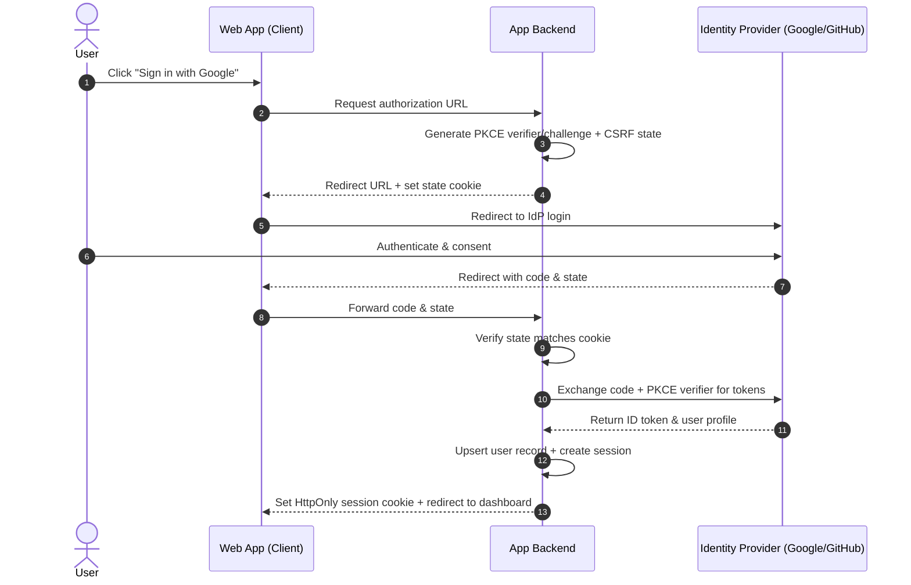

# Authentication & Authorization Specification: [Subsystem / Feature]

- **Author**: [Your Name / Team]
- **Status**: [Draft | In Review | Approved | Implemented]
- **Created**: [YYYY-MM-DD]
- **Auth Provider**: [Supabase Auth / NextAuth / Better-Auth / Clerk / Custom]
- **Session Model**: [Database Session / JWT with Rotating Refresh Token]

---

## 1. Session Storage & Cookie Security

### Cookie Configuration
| Cookie Name | Scope | HttpOnly | Secure | SameSite | Max-Age | Purpose |
| :--- | :--- | :--- | :--- | :--- | :--- | :--- |
| `__Host-session_id` | `/` | Yes | Yes | `Lax` | 7 days | Primary authenticated session identifier |
| `__Host-refresh_token` | `/` | Yes | Yes | `Strict`| 30 days | Rotating refresh token for session renewal |

### Token Expiry & Rotation Rules
- **Access Token TTL**: [e.g., 15 minutes]
- **Refresh Token TTL**: [e.g., 30 days, rolling window]
- **Reuse Detection Strategy**: [If an old refresh token is reused, immediately revoke all active sessions for this user]

---

## 2. Authentication Flows & Sequence

### OAuth 2.0 / OIDC Flow (with PKCE)


---

## 3. RBAC Capability Matrix

| Permission / Capability | Viewer | Member | Admin | Owner | Notes |
| :--- | :---: | :---: | :---: | :---: | :--- |
| `documents:read` | Yes | Yes | Yes | Yes | All members can read shared docs |
| `documents:create` | No | Yes | Yes | Yes | Basic authoring access |
| `documents:delete` | No | Own only | Yes | Yes | Own only evaluated via ABAC |
| `members:invite` | No | No | Yes | Yes | Add collaborators |
| `members:remove` | No | No | Yes | Yes | Cannot remove Owner |
| `billing:manage` | No | No | No | Yes | Subscription and payment methods |

---

## 4. Attribute-Based Access Control (ABAC) Rules

```typescript
// Explicit ABAC rule definitions
export function canDeleteDocument(session: UserSession, document: Document): boolean {
  // Admin and Owner can delete any document in the workspace
  if (['ADMIN', 'OWNER'].includes(session.role)) {
    return session.workspaceId === document.workspaceId;
  }
  
  // Members can only delete documents they created
  if (session.role === 'MEMBER') {
    return document.createdById === session.userId && session.workspaceId === document.workspaceId;
  }
  
  return false;
}
```

---

## 5. Security & Rate-Limiting Controls

| Endpoint / Action | Rate Limit Threshold | Key By | Mitigation on Exceeded |
| :--- | :--- | :--- | :--- |
| `/api/auth/login` | 5 attempts per minute | IP + Target Email | Return HTTP 429 + 15m cooldown |
| `/api/auth/register` | 3 attempts per hour | Client IP | Return HTTP 429 + CAPTCHA challenge |
| `/api/auth/forgot-password` | 3 requests per hour | Target Email | Return generic success message (no user enumeration) |

### Session Invalidation Triggers
All active sessions for a user are revoked immediately upon:
- [ ] User password change or reset.
- [ ] User primary email update.
- [ ] Multi-Factor Authentication (2FA) enablement or reset.
- [ ] Explicit "Sign out of all devices" user action.
- [ ] Refresh token reuse detection alert.
