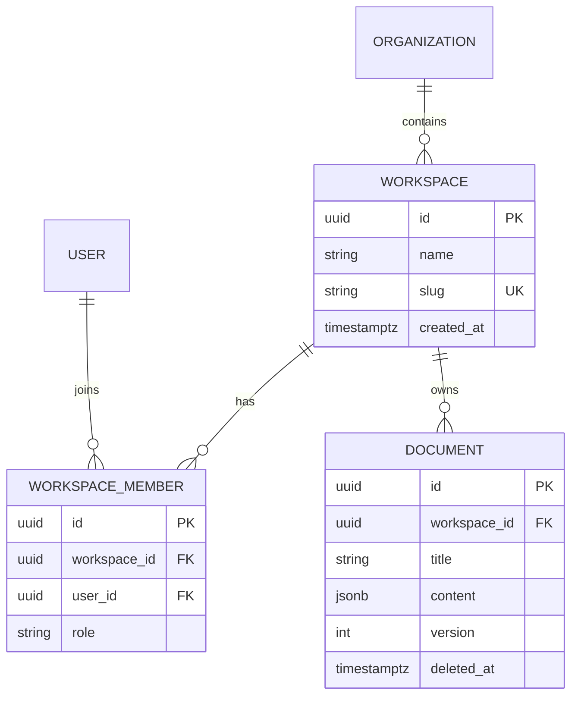

# Data Model Specification: [Subsystem / Feature Name]

- **Author**: [Your Name / Team]
- **Status**: [Draft | In Review | Approved | Implemented]
- **Created**: [YYYY-MM-DD]
- **Target Engine**: [PostgreSQL 16+ / Supabase / MySQL / SQLite]
- **ORM / Query Builder**: [Prisma / Drizzle / Kysely / Raw SQL]

---

## 1. Entity-Relationship Overview

### Mermaid Diagram


---

## 2. Table Schemas & Invariants

### Table: `workspaces`
```sql
CREATE TABLE workspaces (
    id UUID PRIMARY KEY DEFAULT gen_random_uuid(),
    name VARCHAR(100) NOT NULL,
    slug VARCHAR(60) NOT NULL,
    tier VARCHAR(20) NOT NULL DEFAULT 'FREE',
    created_at TIMESTAMPTZ NOT NULL DEFAULT NOW(),
    updated_at TIMESTAMPTZ NOT NULL DEFAULT NOW(),
    CONSTRAINT check_valid_tier CHECK (tier IN ('FREE', 'PRO', 'ENTERPRISE'))
);

CREATE UNIQUE INDEX uq_workspaces_slug ON workspaces (slug);
```

### Table: `documents`
```sql
CREATE TABLE documents (
    id UUID PRIMARY KEY DEFAULT gen_random_uuid(),
    workspace_id UUID NOT NULL REFERENCES workspaces(id) ON DELETE CASCADE,
    title VARCHAR(255) NOT NULL,
    content JSONB NOT NULL DEFAULT '{}'::jsonb,
    version INT NOT NULL DEFAULT 1,
    created_by UUID NOT NULL REFERENCES auth.users(id) ON DELETE RESTRICT,
    created_at TIMESTAMPTZ NOT NULL DEFAULT NOW(),
    updated_at TIMESTAMPTZ NOT NULL DEFAULT NOW(),
    deleted_at TIMESTAMPTZ NULL
);
```

---

## 3. Indexing Strategy

| Index Name | Table | Columns & Ordering | Query Pattern Satisfied | Scan Type Expected |
| :--- | :--- | :--- | :--- | :--- |
| `idx_docs_ws_created` | `documents` | `(workspace_id, created_at DESC)` | `WHERE workspace_id = $1 ORDER BY created_at DESC` | Index Scan |
| `idx_docs_active_title`| `documents`| `(workspace_id, title) WHERE deleted_at IS NULL` | Document search by title for non-deleted records | Partial Index Scan |
| `idx_docs_created_by` | `documents` | `(created_by)` | Foreign key JOIN to users table | Index Scan |

---

## 4. Multi-Tenant Row-Level Security (RLS) (when multi-tenant data exists; otherwise `N/A - <reason>` — e.g., single-tenant or non-Postgres engine with org-ID isolation)

```sql
-- Enable RLS
ALTER TABLE documents ENABLE ROW LEVEL SECURITY;
ALTER TABLE documents FORCE ROW LEVEL SECURITY;

-- Read Policy
CREATE POLICY "Users can view workspace documents"
ON documents FOR SELECT
USING (
    workspace_id IN (
        SELECT workspace_id FROM workspace_members 
        WHERE user_id = auth.uid()
    )
    AND deleted_at IS NULL
);

-- Mutation Policy
CREATE POLICY "Users can insert documents into owned workspace"
ON documents FOR INSERT
WITH CHECK (
    workspace_id IN (
        SELECT workspace_id FROM workspace_members 
        WHERE user_id = auth.uid() AND role IN ('ADMIN', 'EDITOR')
    )
);
```

---

## 5. Concurrency & Transaction Boundaries

- **Critical Concurrent Flow**: [e.g., Workspace seat allocation / Document version updates]
- **Concurrency Control Mechanism**: [Pessimistic row locking with `SELECT FOR UPDATE` | Optimistic locking with `version` column]
- **Resolution Strategy**: [If version mismatch occurs, return HTTP 409 Conflict with latest document state]

---

## 6. Seed Data & Test Harness

### Seed Fixtures
```sql
-- Deterministic local development seed data
INSERT INTO workspaces (id, name, slug, tier) 
VALUES ('00000000-0000-0000-0000-000000000001', 'Acme Corp', 'acme', 'PRO')
ON CONFLICT (id) DO NOTHING;
```

### Integration Test Environment
- Test harness engine: [Docker / Testcontainers / Local Supabase CLI]
- Verification commands: [e.g., `npm run test:db` or `pnpm test:integration`]

---

## 7. Zero-Downtime Migration & Rollback Plan (when live or compatibility-sensitive data exists; otherwise `N/A - <reason>` — one-shot, disposable, or pre-deployment changes may skip with documented rationale)

1. **Phase 1 (Expand)**: [Add column/table as nullable]
2. **Phase 2 (Backfill)**: [Backfill historical rows via background job]
3. **Phase 3 (Contract)**: [Add NOT NULL constraint or drop deprecated column]
- **Rollback Procedure**: [Exact SQL to revert migration if health check fails]
